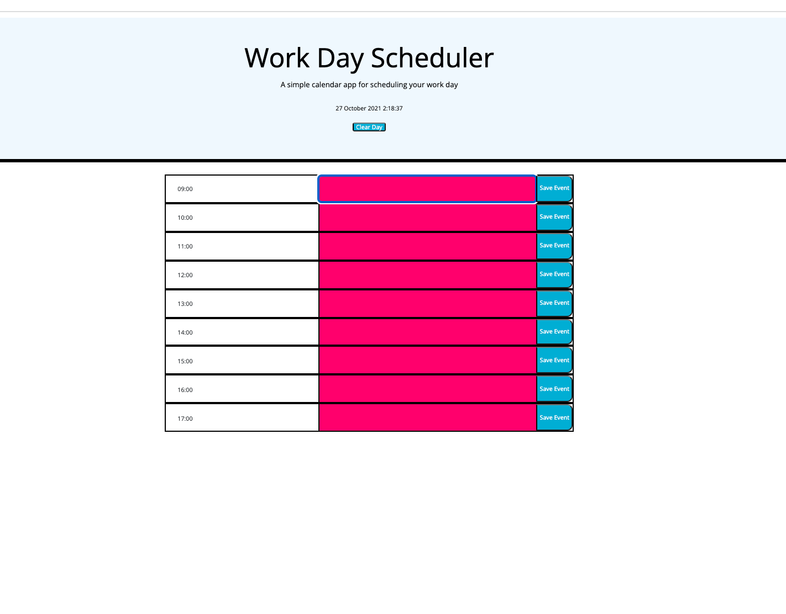
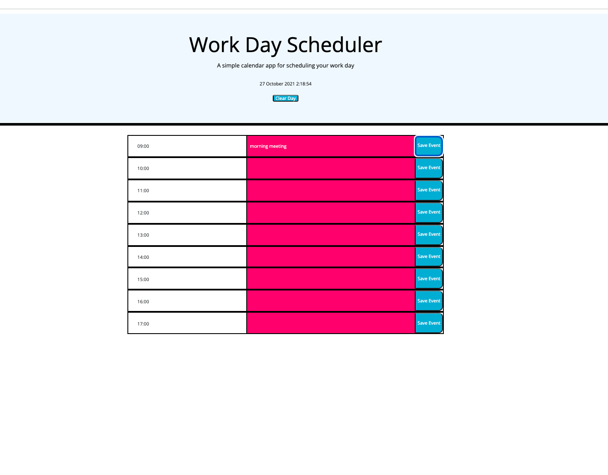

# Work Day Scheduler

a simple calendar application that allows a user to save events for each hour of the day by modifying starter code

## Current Day Display

- Uses moment JS to get today's date

## Time Blocks

- time blocks for 9AM to 5PM
- past time block
- present time block
- future time block
- time block are clickable
- you are able to enter some text
- each time block has a save button (clickable)
- when save button clicked save the event data in local storage for that particular time
- past time blocks will be azure
- present time blocks will be aquarium
- future time blocks will be winter-sky

## Local Storage

key: "planner"

```json
{
  "9": "travel to work",
  "13": "have lunch",
  "17": "go home"
}
```

key | value
9 | "travel to work"
13 | "have lunch"
planner | "{ "9": "travel to work", "13": "have lunch", "17": "go home" }"

## Steps

- on load of page

  - build time blocks
  - set the colours for the time blocks depending on the current hour (15)
  - read from LS
  - iterate over each key value pair and fill in the corresponding time blocks with the text

- add event listeners for the save button click
  - which button the user clicked on (13)
  - get the text value from the time block
  - update LS with the key value pair (13, "have lunch")

## Bonus

- Added a button to clear local storage
- Added a button with the save button to clear that particular time block text
- Added a clock in the header

## Deployed URL

You can view the GitHub pages deployed application [here](https://andradag.github.io/work-day-scheduler/).

## Screenshots

Start Page



Saving time block text


